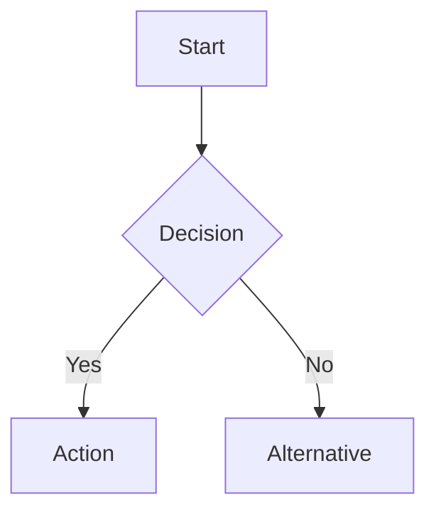

# Physical AI & Humanoid Robotics Textbook

[](https://github.com/your-repo/ai-and-humanoid-robotics-hackathon/actions)
[](https://your-github-username.github.io/ai-and-humanoid-robotics-hackathon/)
[](LICENSE)

A comprehensive, interactive textbook for learning Physical AI and Humanoid Robotics, covering ROS 2, simulation, NVIDIA Isaac, Vision-Language-Action models, and autonomous systems integration.

## 📚 Overview

This textbook provides a complete learning path from robotics fundamentals to building autonomous humanoid systems. It combines theory, hands-on exercises, and a capstone project integrating all concepts.

### Target Audience
- **Undergraduate/Graduate Students** in robotics, computer science, or mechatronics
- **Self-Learners** with programming background (Python/C++)
- **Professionals** transitioning into robotics and Physical AI
- **Instructors** teaching robotics courses (includes instructor guide)

### Learning Outcomes

Upon completing this textbook, you will be able to:
- ✅ Develop ROS 2 applications for distributed robotic systems
- ✅ Create digital twins in Gazebo and Isaac Sim
- ✅ Implement GPU-accelerated perception with Isaac ROS
- ✅ Integrate Vision-Language-Action models for cognitive control
- ✅ Build complete autonomous humanoid systems from simulation to reality

## 📖 Curriculum Structure

### Module 0: Getting Started (Weeks 1-2)
- Introduction to Physical AI concepts
- Course overview and learning objectives
- Development environment setup (Ubuntu 22.04, ROS 2 Humble, Docker)

### Module 1: ROS 2 Fundamentals (Weeks 3-5)
- ROS 2 architecture and DDS middleware
- Nodes, topics, services, and actions
- URDF robot descriptions
- Launch files and best practices

### Module 2: Digital Twin (Weeks 6-7)
- Introduction to robot simulation
- Gazebo fundamentals and SDF format
- Sensor simulation (cameras, LiDAR, IMU)
- Unity integration for visualization
- Sim-to-real transfer techniques

### Module 3: NVIDIA Isaac (Weeks 8-10)
- Isaac Sim photorealistic simulation
- Isaac ROS cuVSLAM for visual localization
- Nav2 autonomous navigation
- Reinforcement learning with Isaac Gym
- Sim-to-real with domain randomization

### Module 4: Vision-Language-Action Models (Weeks 11-12)
- Introduction to VLA architectures
- OpenAI integration for cognitive planning
- Multimodal interaction (speech, gesture, vision)
- Cognitive architectures for embodied AI
- Conversational robotics and social intelligence

### Module 5: Capstone Project (Weeks 13-14)
- System architecture integration
- Voice processing and command interface
- Autonomous navigation and obstacle avoidance
- Computer vision and object manipulation
- Testing, validation, and deployment

## 🚀 Quick Start

### Prerequisites

- **Operating System**: Ubuntu 22.04 LTS (recommended) or Docker
- **Hardware**:
  - **Proxy Tier**: 8GB RAM, quad-core CPU (simulation only)
  - **Miniature Tier**: 16GB RAM, RTX 2060+ GPU (Gazebo + basic Isaac)
  - **Premium Tier**: 32GB RAM, RTX 3060+ GPU (full Isaac Sim capabilities)
- **Software**: Node.js 18+, npm 9+

### Installation

1. **Clone the repository:**
   ```bash
   git clone https://github.com/your-repo/ai-and-humanoid-robotics-hackathon.git
   cd ai-and-humanoid-robotics-hackathon
   ```

2. **Install dependencies:**
   ```bash
   npm install
   ```

3. **Start local development server:**
   ```bash
   npm start
   ```

4. **Open in browser:**
   Navigate to `http://localhost:3000` to view the textbook.

### Build for Production

```bash
npm run build
```

This command generates static content into the `build` directory that can be served using any static hosting service.

## 🛠️ Development

### Project Structure

```
ai-and-humanoid-robotics-hackathon/
├── docs/                           # Markdown content
│   ├── intro.md                    # Homepage
│   ├── module-0-getting-started/   # Module 0 chapters
│   ├── module-1-ros2/              # Module 1 chapters
│   ├── module-2-digital-twin/      # Module 2 chapters
│   ├── module-3-isaac/             # Module 3 chapters
│   ├── module-4-vla/               # Module 4 chapters
│   ├── module-5-capstone/          # Module 5 chapters
│   ├── hardware-guide.md           # Hardware setup instructions
│   ├── glossary.md                 # Technical term definitions
│   ├── instructor-guide.md         # Teaching resources
│   └── changelog.md                # Version history
├── static/                         # Static assets
│   ├── img/                        # Images and diagrams
│   ├── code/                       # Downloadable code examples
│   └── validation-scripts/         # Exercise validation tools
├── src/                            # React components
│   ├── components/                 # Custom components
│   └── css/                        # Custom styling
├── docusaurus.config.js            # Docusaurus configuration
├── sidebars.js                     # Sidebar navigation
└── package.json                    # Dependencies

```

### Available Scripts

- `npm start` - Start local development server
- `npm run build` - Build for production
- `npm run serve` - Serve production build locally
- `npm run clear` - Clear Docusaurus cache
- `npm run lint:markdown` - Lint all Markdown files
- `npm run validate:frontmatter` - Validate chapter frontmatter
- `npm run check:links` - Check for broken links
- `npm run audit:a11y` - Run accessibility audit

### Content Guidelines

#### Chapter Frontmatter Requirements

All chapter files must include the following frontmatter:

```yaml
---
id: module-X-chapter-Y
title: "Chapter Title"
sidebar_label: "X.Y Short Title"
sidebar_position: Y
description: "Brief description for SEO (120-160 characters)"
keywords: [keyword1, keyword2, keyword3]
estimated_time: 60  # minutes
prerequisites:
  - module-X-chapter-Y
  - concept-name
learning_outcomes:
  - Outcome 1
  - Outcome 2
  - Outcome 3
hardware_tier: proxy | miniature | premium
---
```

#### Code Examples

All code examples should include:
- **Docstrings**: Document purpose, parameters, and return values
- **Type Hints**: Use Python type hints or C++ types
- **Comments**: Explain non-obvious logic
- **Requirements**: Include `requirements.txt` or dependency list
- **Validation**: Provide test script or expected output

#### Diagrams

Use Mermaid for interactive diagrams:

````markdown

````

## 🎓 For Instructors

The textbook includes comprehensive instructor resources:

- **Lecture Slides**: PowerPoint/PDF slides for each module
- **Solution Keys**: Complete solutions for exercises and capstone
- **Grading Rubrics**: Assessment criteria for projects
- **Lab Configurations**: Equipment lists for institutional labs
- **Assignment Templates**: Structured homework and project templates

See the [Instructor Guide](docs/instructor-guide.md) for full details.

## 🤝 Contributing

We welcome contributions from the robotics community!

### How to Contribute

1. **Fork the repository**
2. **Create a feature branch**: `git checkout -b feature/new-chapter`
3. **Make your changes** following our content guidelines
4. **Test locally**: `npm start` to preview
5. **Submit a pull request** with a clear description

### Contribution Areas

- 📝 **Content**: Add chapters, improve explanations, fix errors
- 💻 **Code Examples**: Contribute tested ROS 2/Python/C++ examples
- 🎨 **Diagrams**: Create Mermaid diagrams for complex concepts
- 🧪 **Exercises**: Design hands-on activities with validation scripts
- 🌐 **Translations**: Translate content to Urdu or other languages
- 🐛 **Bug Reports**: Identify broken links, errors, or unclear content

See [CONTRIBUTING.md](CONTRIBUTING.md) for detailed guidelines.

## 📋 Roadmap

### v1.0.0 (Current) - December 2025
✅ Complete 5-module curriculum (32+ chapters)
✅ 100+ code examples with validation
✅ Interactive Mermaid diagrams
✅ Hardware guide for 3 tiers
✅ Glossary with 200+ terms
✅ Instructor resources

### v1.1.0 (Planned) - March 2026
- 🔲 Extended Reality (XR/VR) integration
- 🔲 Advanced AI topics (diffusion models, transformers)
- 🔲 Industrial robotics applications
- 🔲 Ethics and safety curriculum
- 🔲 Complete Urdu translation

### v2.0.0 (Future) - 2026
- 🔲 Browser-based interactive simulations
- 🔲 Embedded video lectures
- 🔲 Adaptive learning paths
- 🔲 Industry partnerships and case studies
- 🔲 Professional certification tracks

## 📄 License

This project is licensed under the MIT License - see the [LICENSE](LICENSE) file for details.

## 🙏 Acknowledgments

- **ROS 2 Community** for the incredible robotics framework
- **NVIDIA** for Isaac Sim and GPU-accelerated tools
- **Docusaurus Team** for the excellent documentation platform
- **Contributors** who have improved this textbook

## 📞 Support

- **Documentation**: [Live Textbook](https://your-github-username.github.io/ai-and-humanoid-robotics-hackathon/)
- **Issues**: [GitHub Issues](https://github.com/your-repo/ai-and-humanoid-robotics-hackathon/issues)
- **Discussions**: [GitHub Discussions](https://github.com/your-repo/ai-and-humanoid-robotics-hackathon/discussions)
- **Discord**: [Join our community](https://discord.gg/your-server)

## ⭐ Star History

If you find this textbook helpful, please consider giving it a star on GitHub! ⭐

---

**Built with ❤️ by the Physical AI Curriculum Team**
