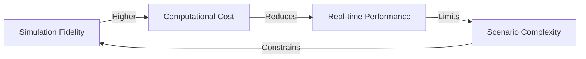

# Chapter 2.1: Introduction to Robot Simulation

Robot simulation is a fundamental tool in modern robotics development, enabling testing, validation, and training without physical hardware. This chapter introduces the concepts, tools, and techniques that make simulation an essential component of the robotics development workflow.

## Why Robot Simulation?

Simulation provides numerous advantages in robotics development:

### Cost Efficiency
- **Reduced Hardware Costs**: Test algorithms without purchasing expensive robots
- **No Breakage Risk**: Experiment freely without damaging physical hardware
- **Parallel Testing**: Run multiple simulations simultaneously

### Development Speed
- **Rapid Iteration**: Test changes instantly without physical setup time
- **Automated Testing**: Run regression tests continuously
- **Scenario Replication**: Reproduce exact conditions repeatedly

### Safety
- **Risk-Free Experimentation**: Test dangerous scenarios safely
- **Failure Analysis**: Analyze crashes without consequences
- **Training Data Generation**: Create synthetic datasets for machine learning

### Scalability
- **Multi-Robot Systems**: Test swarm behaviors with virtual fleets
- **Extreme Conditions**: Simulate environments difficult to recreate physically
- **Long-Duration Testing**: Accelerate time for endurance tests

## Major Simulation Platforms

### Gazebo (Classic and Harmonic)

Gazebo is an open-source robotics simulator with strong ROS 2 integration.

**Strengths:**
- Native ROS 2 support
- Large community and ecosystem
- Comprehensive sensor simulation
- SDF (Simulation Description Format) support

**Use Cases:**
- Mobile robot navigation
- Manipulation tasks
- Multi-robot coordination
- Undergraduate robotics education

### NVIDIA Isaac Sim

Isaac Sim is a photorealistic simulator built on NVIDIA Omniverse platform.

**Strengths:**
- Photorealistic rendering with RTX ray tracing
- High-fidelity physics (PhysX 5)
- Synthetic data generation for AI training
- Integrated reinforcement learning frameworks

**Use Cases:**
- Computer vision algorithm development
- Sim-to-real transfer for deep learning
- Warehouse automation
- Humanoid robotics (Module 3 focus)

### MuJoCo

MuJoCo (Multi-Joint dynamics with Contact) is known for fast, accurate physics.

**Strengths:**
- Extremely fast physics simulation
- Contact-rich environments
- Optimization-based dynamics
- Popular in reinforcement learning research

**Use Cases:**
- Legged locomotion
- Contact-rich manipulation
- Model predictive control
- Research applications

## Physics Engines Fundamentals

### Rigid Body Dynamics

Physics engines simulate how objects move and interact:

- **Collision Detection**: Identify when objects intersect
- **Contact Resolution**: Compute forces when objects touch
- **Integration**: Update positions and velocities over time
- **Constraint Solving**: Enforce joint limits and connections

### Common Physics Engines

| Engine | Simulation Type | Speed | Accuracy | ROS 2 Integration |
|--------|----------------|-------|----------|-------------------|
| ODE | Rigid body | Fast | Moderate | Gazebo Classic |
| DART | Articulated | Moderate | High | Gazebo Harmonic |
| PhysX | Rigid/soft body | Very Fast | High | Isaac Sim |
| Bullet | Rigid body | Fast | Moderate | PyBullet |
| MuJoCo | Articulated | Very Fast | Very High | Standalone |

### Physics Simulation Trade-offs



Finding the right balance depends on your application requirements.

## Sensor Simulation

Accurate sensor simulation is crucial for developing perception algorithms.

### Camera Simulation
- **RGB Cameras**: Visual appearance
- **Depth Cameras**: Distance measurements (Time-of-Flight, structured light)
- **Semantic Segmentation**: Ground truth labels for ML training
- **Instance Segmentation**: Individual object identification

### LiDAR Simulation
- **Ray Casting**: Simulate laser beam reflections
- **Point Cloud Generation**: Produce 3D point clouds
- **Noise Models**: Realistic measurement errors
- **Multi-echo Support**: Advanced LiDAR features

### IMU Simulation
- **Accelerometer**: Linear acceleration
- **Gyroscope**: Angular velocity
- **Magnetometer**: Orientation reference
- **Noise and Bias**: Realistic sensor imperfections

### Contact Sensors
- **Force-Torque Sensors**: Measure interaction forces
- **Tactile Sensors**: Surface contact detection
- **Bumper Sensors**: Binary collision detection

## Sim-to-Real Transfer

The "reality gap" is the difference between simulation and real-world behavior.

### Domain Randomization

Vary simulation parameters to improve real-world robustness:

```python
# Example: Randomize lighting conditions
import random

for training_episode in range(1000):
    light_intensity = random.uniform(100, 1000)  # lux
    light_color_temp = random.uniform(2700, 6500)  # Kelvin

    # Run simulation with randomized lighting
    run_simulation(light_intensity, light_color_temp)
```

### System Identification

Measure real-world parameters and update simulation:

1. **Physical Measurements**: Weigh components, measure dimensions
2. **Dynamics Identification**: Record motion and fit models
3. **Sensor Calibration**: Match simulated sensor characteristics
4. **Material Properties**: Friction, elasticity, damping

### Progressive Fidelity

Start with simple simulation, gradually increase realism:

1. **Kinematic Simulation**: Test basic logic without physics
2. **Rigid Body Physics**: Add collision and forces
3. **Sensor Noise**: Include realistic imperfections
4. **Environmental Variation**: Randomize conditions

## Digital Twin Concept

A digital twin is a virtual representation synchronized with a physical system.

### Digital Twin Components

- **Model Fidelity**: Accurate geometry and physics
- **Real-time Synchronization**: Mirror actual robot state
- **Predictive Capabilities**: Forecast future behavior
- **Bidirectional Communication**: Control virtual and physical robots

### Use Cases for Digital Twins

- **Remote Monitoring**: Observe robots in distant locations
- **Predictive Maintenance**: Identify issues before failure
- **Operator Training**: Practice control in safe environment
- **System Optimization**: Test improvements before deployment

## Practical Exercise: Simulation Platform Comparison

Compare simulation platforms by implementing a simple scenario:

1. Create a mobile robot with a camera in Gazebo
2. Create the same robot in Isaac Sim (if available)
3. Compare:
   - Setup complexity
   - Rendering quality
   - Physics accuracy
   - Integration with ROS 2

Document the trade-offs you observe.

## Next Chapter

In [Chapter 2.2: Gazebo Fundamentals](./chapter-2-2.md), you'll learn to set up Gazebo environments, create world files, and spawn robots in simulation.
