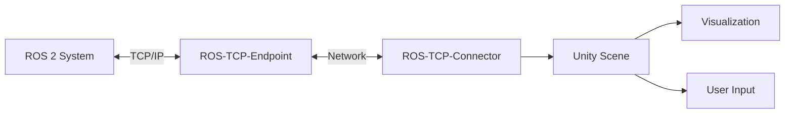

# Chapter 2.5: Unity Integration for Visualization

Unity provides photorealistic rendering and advanced UI capabilities beyond traditional robotics simulators. This chapter explores Unity as a visualization and interaction platform for ROS 2 systems.

## Why Unity for Robotics?

While Gazebo excels at physics simulation, Unity offers complementary capabilities that make it valuable for robotics development:

### Advantages of Unity

- **Photorealistic Rendering**: Advanced graphics for computer vision development
- **Cross-Platform Deployment**: Build AR/VR interfaces for multiple devices
- **User Interface Tools**: Sophisticated UI/UX for robot monitoring and control
- **Asset Ecosystem**: Vast library of 3D models and environments
- **Performance**: Optimized rendering engine for real-time visualization

### Unity vs. Gazebo Comparison

| Feature | Unity | Gazebo |
|---------|-------|--------|
| Physics Accuracy | Moderate (PhysX) | High (DART/ODE) |
| Visual Quality | Excellent | Good |
| ROS 2 Integration | Via Unity Robotics Hub | Native |
| AR/VR Support | Excellent | Limited |
| Learning Curve | Moderate | Moderate |
| Use Case | Visualization, UI, training | Simulation, testing |

**Best Practice**: Use Gazebo for physics-accurate simulation and Unity for visualization, operator interfaces, and AR/VR applications.

## Unity Robotics Hub

Unity Robotics Hub enables communication between Unity and ROS 2 systems.

### Architecture



### Components

- **ROS-TCP-Endpoint**: ROS 2 package that receives/sends messages
- **ROS-TCP-Connector**: Unity package for network communication
- **URDF Importer**: Convert URDF robot descriptions to Unity GameObjects

## Setting Up Unity Robotics Hub

### Prerequisites

```bash
# Install Unity Hub and Unity Editor (2021.3 LTS or later)
# Download from: https://unity.com/download

# Install ROS 2 packages
sudo apt update
sudo apt install ros-humble-ros-tcp-endpoint
```

### Step 1: Create Unity Project

1. Open Unity Hub
2. Create new 3D project (URP template recommended)
3. Name: `RobotVisualization`

### Step 2: Install Unity Packages

Open Package Manager (Window > Package Manager):

```
1. Click "+" → Add package from git URL
2. Enter: https://github.com/Unity-Technologies/ROS-TCP-Connector.git?path=/com.unity.robotics.ros-tcp-connector
3. Wait for installation
4. Repeat for URDF Importer:
   https://github.com/Unity-Technologies/URDF-Importer.git?path=/com.unity.robotics.urdf-importer
```

### Step 3: Configure ROS Connection

1. Go to Robotics > ROS Settings
2. Set ROS IP Address: `127.0.0.1` (localhost)
3. Set ROS Port: `10000`
4. Protocol: ROS 2

### Step 4: Launch ROS-TCP-Endpoint

```bash
# Source ROS 2 workspace
source /opt/ros/humble/setup.bash

# Launch endpoint server
ros2 run ros_tcp_endpoint default_server_endpoint --ros-args -p ROS_IP:=0.0.0.0 -p ROS_TCP_PORT:=10000
```

**Validation**: Check for "Starting server on 0.0.0.0:10000" message.

## Importing URDF Models

### Method 1: URDF Importer UI

1. In Unity: Assets > Import Robot from URDF
2. Browse to your `.urdf` file
3. Configure import settings:
   - **Axis Type**: Y-axis (Unity standard)
   - **Mesh Decomposer**: VHACD (for colliders)
4. Click "Import"

### Method 2: Scripted Import

```csharp
using Unity.Robotics.UrdfImporter;
using UnityEngine;

public class RobotLoader : MonoBehaviour
{
    void Start()
    {
        // Import URDF programmatically
        string urdfPath = "/path/to/robot.urdf";
        UrdfRobotExtensions.CreateRuntime(urdfPath, new ImportSettings
        {
            choosenAxis = ImportSettings.axisType.yAxis,
            convexMethod = ImportSettings.convexDecomposer.vHACD
        });
    }
}
```

### URDF to Unity Coordinate Transform

Unity uses left-handed Y-up coordinates, while ROS uses right-handed Z-up:

| ROS | Unity |
|-----|-------|
| +X forward | +Z forward |
| +Y left | +X right |
| +Z up | +Y up |

The importer handles this transformation automatically.

## ROS 2 Communication in Unity

### Publishing Messages from Unity

```csharp
using RosMessageTypes.Geometry;
using Unity.Robotics.ROSTCPConnector;
using UnityEngine;

public class VelocityPublisher : MonoBehaviour
{
    ROSConnection ros;
    private string topicName = "/cmd_vel";

    void Start()
    {
        ros = ROSConnection.GetOrCreateInstance();
        ros.RegisterPublisher<TwistMsg>(topicName);
    }

    void Update()
    {
        // Send velocity command on spacebar press
        if (Input.GetKeyDown(KeyCode.Space))
        {
            TwistMsg twist = new TwistMsg
            {
                linear = new Vector3Msg { x = 0.5, y = 0, z = 0 },
                angular = new Vector3Msg { x = 0, y = 0, z = 0 }
            };
            ros.Publish(topicName, twist);
        }
    }
}
```

### Subscribing to ROS 2 Topics

```csharp
using RosMessageTypes.Sensor;
using Unity.Robotics.ROSTCPConnector;
using UnityEngine;

public class LaserScanVisualizer : MonoBehaviour
{
    ROSConnection ros;
    private string topicName = "/scan";

    void Start()
    {
        ros = ROSConnection.GetOrCreateInstance();
        ros.Subscribe<LaserScanMsg>(topicName, UpdateLaserScan);
    }

    void UpdateLaserScan(LaserScanMsg msg)
    {
        // Visualize laser scan data
        for (int i = 0; i < msg.ranges.Length; i++)
        {
            float angle = msg.angle_min + i * msg.angle_increment;
            float range = msg.ranges[i];

            if (range < msg.range_max)
            {
                Vector3 point = new Vector3(
                    Mathf.Cos(angle) * range,
                    0,
                    Mathf.Sin(angle) * range
                );
                Debug.DrawRay(transform.position, point, Color.red);
            }
        }
    }
}
```

## Creating Interactive Interfaces

### Robot Control Panel

Create a Canvas-based UI for robot control:

```csharp
using RosMessageTypes.Std;
using Unity.Robotics.ROSTCPConnector;
using UnityEngine;
using UnityEngine.UI;

public class RobotControlPanel : MonoBehaviour
{
    public Slider speedSlider;
    public Button stopButton;
    public Text statusText;

    ROSConnection ros;
    private string cmdVelTopic = "/cmd_vel";
    private string statusTopic = "/robot_status";

    void Start()
    {
        ros = ROSConnection.GetOrCreateInstance();
        ros.RegisterPublisher<TwistMsg>(cmdVelTopic);
        ros.Subscribe<StringMsg>(statusTopic, UpdateStatus);

        stopButton.onClick.AddListener(EmergencyStop);
    }

    public void SetRobotSpeed()
    {
        float speed = speedSlider.value;
        TwistMsg twist = new TwistMsg
        {
            linear = new Vector3Msg { x = speed, y = 0, z = 0 }
        };
        ros.Publish(cmdVelTopic, twist);
    }

    void EmergencyStop()
    {
        TwistMsg stop = new TwistMsg();
        ros.Publish(cmdVelTopic, stop);
    }

    void UpdateStatus(StringMsg msg)
    {
        statusText.text = msg.data;
    }
}
```

## AR/VR Integration

### Virtual Reality Robot Control

```csharp
using UnityEngine;
using UnityEngine.XR;
using Unity.Robotics.ROSTCPConnector;

public class VRRobotController : MonoBehaviour
{
    ROSConnection ros;
    private InputDevice rightController;

    void Start()
    {
        ros = ROSConnection.GetOrCreateInstance();
        ros.RegisterPublisher<TwistMsg>("/cmd_vel");

        // Get VR controller
        rightController = InputDevices.GetDeviceAtXRNode(XRNode.RightHand);
    }

    void Update()
    {
        // Read joystick input from VR controller
        Vector2 joystick;
        if (rightController.TryGetFeatureValue(CommonUsages.primary2DAxis, out joystick))
        {
            TwistMsg twist = new TwistMsg
            {
                linear = new Vector3Msg { x = joystick.y * 2.0, y = 0, z = 0 },
                angular = new Vector3Msg { x = 0, y = 0, z = joystick.x * 1.0 }
            };
            ros.Publish("/cmd_vel", twist);
        }
    }
}
```

### Augmented Reality Overlay

Display robot status in AR:

```csharp
using RosMessageTypes.Sensor;
using UnityEngine;
using UnityEngine.XR.ARFoundation;

public class ARRobotOverlay : MonoBehaviour
{
    public ARSession arSession;
    public GameObject robotPrefab;

    private GameObject virtualRobot;
    ROSConnection ros;

    void Start()
    {
        ros = ROSConnection.GetOrCreateInstance();
        ros.Subscribe<JointStateMsg>("/joint_states", UpdateRobotPose);

        // Spawn virtual robot in AR
        virtualRobot = Instantiate(robotPrefab);
    }

    void UpdateRobotPose(JointStateMsg msg)
    {
        // Update virtual robot to match real robot
        ArticulationBody[] joints = virtualRobot.GetComponentsInChildren<ArticulationBody>();
        for (int i = 0; i < msg.position.Length; i++)
        {
            if (i < joints.Length)
            {
                var drive = joints[i].xDrive;
                drive.target = (float)msg.position[i] * Mathf.Rad2Deg;
                joints[i].xDrive = drive;
            }
        }
    }
}
```

## Digital Twin Visualization

Synchronize Unity visualization with real robot:

```csharp
using RosMessageTypes.Nav;
using Unity.Robotics.ROSTCPConnector;
using UnityEngine;

public class DigitalTwinSync : MonoBehaviour
{
    ROSConnection ros;
    public Transform robotTransform;

    void Start()
    {
        ros = ROSConnection.GetOrCreateInstance();
        ros.Subscribe<OdometryMsg>("/odom", UpdatePose);
    }

    void UpdatePose(OdometryMsg msg)
    {
        // Update Unity robot position to match real robot
        Vector3 position = new Vector3(
            (float)msg.pose.pose.position.x,
            (float)msg.pose.pose.position.y,
            (float)msg.pose.pose.position.z
        );

        Quaternion rotation = new Quaternion(
            (float)msg.pose.pose.orientation.x,
            (float)msg.pose.pose.orientation.y,
            (float)msg.pose.pose.orientation.z,
            (float)msg.pose.pose.orientation.w
        );

        robotTransform.position = position;
        robotTransform.rotation = rotation;
    }
}
```

## Performance Optimization

### Frame Rate Optimization

```csharp
void Start()
{
    // Target 60 FPS for smooth visualization
    Application.targetFrameRate = 60;

    // Enable VSync for smoother rendering
    QualitySettings.vSyncCount = 1;
}
```

### Level of Detail (LOD)

Use LOD groups for complex robots:

1. Create multiple mesh versions (high, medium, low detail)
2. Add LOD Group component
3. Configure distance thresholds:
   - LOD 0: 0-10m (high detail)
   - LOD 1: 10-30m (medium detail)
   - LOD 2: 30m+ (low detail)

## Practical Exercise: Unity Digital Twin

Build a complete Unity-ROS 2 digital twin:

1. **Import Robot**: Use URDF importer for your robot model
2. **Setup Communication**: Configure ROS-TCP connection
3. **Subscribe to State**: Listen to `/joint_states` and `/odom`
4. **Create UI**: Build control panel with sliders and buttons
5. **Add Visualization**: Display sensor data (cameras, LiDAR)
6. **Test Synchronization**: Verify Unity mirrors real robot motion

**Validation**:
- [ ] URDF imports correctly with proper transforms
- [ ] ROS 2 topics connect successfully
- [ ] Robot pose updates in real-time
- [ ] UI controls send commands to ROS 2
- [ ] Frame rate maintains 30+ FPS

## Use Case: Operator Training

Unity excels for training robot operators:

- **Virtual Training**: Practice control without hardware risk
- **Multiple Views**: Camera angles impossible with physical robots
- **Replay Functionality**: Review and analyze past operations
- **Scenario Simulation**: Practice emergency procedures

## Troubleshooting

| Issue | Cause | Solution |
|-------|-------|----------|
| Connection timeout | ROS endpoint not running | Verify `ros2 run ros_tcp_endpoint` is active |
| URDF import fails | Missing mesh files | Check mesh paths in URDF are correct |
| Slow performance | Complex models | Enable LOD groups, reduce polygon count |
| Incorrect robot orientation | Coordinate system mismatch | Verify axis settings in URDF importer |
| Topics not appearing | Wrong ROS version | Ensure ROS 2 is selected in ROS Settings |

## Next Chapter

In [Chapter 2.6: Sim-to-Real Transfer Techniques](./chapter-2-6.md), you'll learn strategies to bridge the reality gap and successfully deploy simulated algorithms on physical robots.


