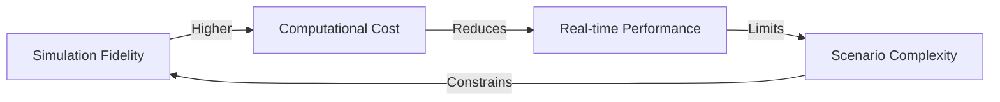

# باب 2.1: روبوٹ سیمیولیشن کا تعارف

روبوٹ سیمیولیشن جدید روبوٹکس ترقی کا ایک بنیادی آلہ ہے، جو جسمانی ہارڈویئر کے بغیر ٹیسٹنگ، توثیق، اور تربیت کو ممکن بناتا ہے۔ یہ باب ان تصورات، اوزار، اور تکنیکوں کا تعارف پیش کرتا ہے جو سیمیولیشن کو روبوٹکس ترقی کے ورک فلو کا ایک ضروری جز بناتے ہیں۔

## روبوٹ سیمیولیشن کیوں؟

سیمیولیشن روبوٹکس ترقی میں متعدد فوائد فراہم کرتا ہے:

### لاگت کی کارکردگی
- **کم ہارڈویئر لاگت**: مہنگے روبوٹس خریدے بغیر الگورتھم کا ٹیسٹ کریں
- **کوئی ٹوٹ پھوٹ کا خطرہ نہیں**: جسمانی ہارڈویئر کو نقصان پہنچائے بغیر آزادانہ تجربہ کریں
- **متوازن ٹیسٹنگ**: ایک ساتھ کئی سیمیولیشنز چلائیں

### ترقی کی رفتار
- **تیز تکرار**: جسمانی سیٹ اپ کے وقت کے بغیر فوری تبدیلیوں کا ٹیسٹ کریں
- **خودکار ٹیسٹنگ**: مسلسل ریگریشن ٹیسٹ چلائیں
- **منظرناموں کی نقل**: یکساں شرائط کو بار بار دوبارہ بنائیں

### حفاظت
- **بغیر خطرہ کے تجربہ**: خطرناک منظرناموں کا محفوظ طریقے سے ٹیسٹ کریں
- **ناکامی کا تجزیہ**: نتائج کے بغیر کرشز کا تجزیہ کریں
- **تربیت کے ڈیٹا کی پیدائش**: مشین لرننگ کے لیے مصنوعی ڈیٹا سیٹ بنائیں

### پیمائش
- **ملٹی روبوٹ سسٹمز**: ورچوئل بیڑوں کے ساتھ سوارم رویوں کا ٹیسٹ کریں
- **انتہائی شرائط**: جسمانی طور پر دوبارہ بنانے میں دشوار ماحول کی سیمیولیشن کریں
- **طویل مدت کی ٹیسٹنگ**: استقامت کے ٹیسٹ کے لیے وقت کو تیز کریں

## اہم سیمیولیشن پلیٹ فارمز

### گیزیبو (کلاسک اور ہارمونک)

گیزیبو ایک اوپن سورس روبوٹکس سیمیولیٹر ہے جس میں ROS 2 انٹیگریشن مضبوط ہے۔

**تقویت:**
- ROS 2 کی مقامی حمایت
- بڑا کمیونٹی اور ایکو سسٹم
- جامع سینسر سیمیولیشن
- SDF (سیمیولیشن ڈیسکرپشن فارمیٹ) کی حمایت

**استعمال کے معاملات:**
- موبائل روبوٹ نیویگیشن
- ہیرا پھیری کے کام
- ملٹی روبوٹ کوآرڈینیشن
- انڈرگریجویٹ روبوٹکس تعلیم

### NVIDIA آئیک سِم

آئیک سِم ایک فوٹو ریئلسٹک سیمیولیٹر ہے جو NVIDIA Omniverse پلیٹ فارم پر بنایا گیا ہے۔

**تقویت:**
- RTX ری ٹریسنگ کے ساتھ فوٹو ریئلسٹک رینڈرنگ
- ہائی فیڈیلٹی فزکس (PhysX 5)
- AI تربیت کے لیے مصنوعی ڈیٹا کی پیدائش
- مربوط تقویت سیکھنے کے فریم ورک

**استعمال کے معاملات:**
- کمپیوٹر ویژن الگورتھم کی ترقی
- ڈیپ لرننگ کے لیے سِم ٹو ریئل ٹرانسفر
- ویئر ہاؤس آٹومیشن
- ہیومینائڈ روبوٹکس (ماڈیول 3 فوکس)

### MuJoCo

MuJoCo (ملٹی جوائنٹ ڈائنامکس ود کونٹیکٹ) تیز، درست فزکس کے لیے جانا جاتا ہے۔

**تقویت:**
- انتہائی تیز فزکس سیمیولیشن
- کونٹیکٹ سے بھرپور ماحول
- آپٹیمائزیشن پر مبنی ڈائنامکس
- تقویت سیکھنے کے تحقیق میں مقبول

**استعمال کے معاملات:**
- لیگڈ لوکوموشن
- کونٹیکٹ سے بھرپور ہیرا پھیری
- ماڈل پیشگو کنٹرول
- تحقیقی ایپلی کیشنز

## فزکس انجنز کی بنیادی باتیں

### ریجڈ باڈی ڈائنامکس

فزکس انجنز اس بات کی سیمیولیشن کرتے ہیں کہ اشیاء کیسے حرکت کرتی ہیں اور بات چیت کرتی ہیں:

- **ٹکراؤ کی شناخت**: جب اشیاء ایک دوسرے کو کٹاتی ہیں تو شناخت کریں
- **کونٹیکٹ حل**: جب اشیاء چھوتی ہیں تو فورسز کا حساب لگائیں
- **انٹیگریشن**: وقت کے ساتھ پوزیشنز اور ویلوسیٹیز کو اپ ڈیٹ کریں
- **پابندیوں کا حل**: جوائنٹ لیمیٹس اور کنکشنز کو نافذ کریں

### عام فزکس انجنز

| انجن | سیمیولیشن کی قسم | رفتار | درستی | ROS 2 انٹیگریشن |
|--------|----------------|-------|----------|-------------------|
| ODE | ریجڈ باڈی | تیز | معتدل | گیزیبو کلاسک |
| DART | آرٹیکولیٹڈ | معتدل | زیادہ | گیزیبو ہارمونک |
| PhysX | ریجڈ/سافٹ باڈی | بہت تیز | زیادہ | آئیک سِم |
| Bullet | ریجڈ باڈی | تیز | معتدل | PyBullet |
| MuJoCo | آرٹیکولیٹڈ | بہت تیز | بہت زیادہ | اسٹینڈالون |

### فزکس سیمیولیشن کے ٹریڈ آف



درست توازن تلاش کرنا آپ کی ایپلی کیشن کی ضروریات پر منحصر ہے۔

## سینسر سیمیولیشن

پرسیپشن الگورتھم کی ترقی کے لیے درست سینسر سیمیولیشن ضروری ہے۔

### کیمرہ سیمیولیشن
- **RGB کیمرے**: بصری ظاہری شکل
- **ڈیپتھ کیمرے**: فاصلے کی پیمائش (ٹائم آف فلائٹ، ساختہ روشنی)
- **سیمانٹک سیگمنٹیشن**: ML تربیت کے لیے گراؤنڈ ٹروتھ لیبلز
- **انسٹنس سیگمنٹیشن**: انفرادی اشیاء کی شناخت

### LiDAR سیمیولیشن
- **ری کیسٹنگ**: لیزر بیم ریفلیکشنز کی سیمیولیشن کریں
- **پوائنٹ کلاؤڈ جنریشن**: 3D پوائنٹ کلاؤڈز پیدا کریں
- **نویز ماڈلز**: حقیقی پیمائش کی غلطیاں
- **ملٹی ایکو سپورٹ**: ایڈوانسڈ LiDAR فیچرز

### IMU سیمیولیشن
- **ایکسیلرو میٹر**: لینیئر ایکسیلریشن
- **جائیروسکوپ**: اینگولر ویلوسیٹی
- **میگنیٹومیٹر**: اورینٹیشن ریفرنس
- **نویز اور بائیس**: حقیقی سینسر کی خامیوں

### کونٹیکٹ سینسرز
- **فورس ٹارک سینسرز**: بات چیت کے فورسز کی پیمائش کریں
- **ٹیکٹائل سینسرز**: سطحی کونٹیکٹ کی شناخت
- **بمپر سینسرز**: بائنری ٹکراؤ کی شناخت

## سِم ٹو ریئل ٹرانسفر

"حقیقت کا فرق" سیمیولیشن اور حقیقی دنیا کے رویے کے درمیان فرق ہے۔

### ڈومین رینڈمائزیشن

حقیقی دنیا کی مضبوطی کو بہتر بنانے کے لیے سیمیولیشن پیرامیٹرز کو مختلف کریں:

```python
# Example: Randomize lighting conditions
import random

for training_episode in range(1000):
    light_intensity = random.uniform(100, 1000)  # lux
    light_color_temp = random.uniform(2700, 6500)  # Kelvin

    # Run simulation with randomized lighting
    run_simulation(light_intensity, light_color_temp)
```

### سسٹم شناخت

حقیقی دنیا کے پیرامیٹرز کی پیمائش کریں اور سیمیولیشن کو اپ ڈیٹ کریں:

1. **فزیکل پیمائش**: اجزاء کا وزن کریں، جگہ کی پیمائش کریں
2. **ڈائنامکس شناخت**: موشن ریکارڈ کریں اور ماڈلز فٹ کریں
3. **سینسر کیلیبریشن**: سیمیولیٹڈ سینسر کی خصوصیات سے میل کریں
4. **میٹریل پراپرٹیز**: رگڑ، لچک، ڈیمپنگ

### پروگریسو فی