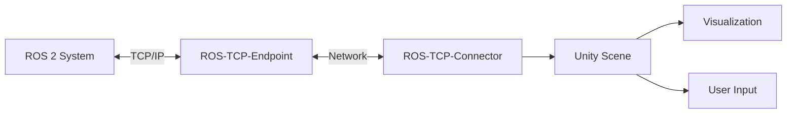

# باب 2.5: یونٹی انٹیگریشن برائے ویژولائزیشن

یونٹی روایتی روبوٹکس سمولیٹرز سے زیادہ فوٹو ریئلسٹک رینڈرنگ اور اعلیٰ UI صلاحیتیں فراہم کرتا ہے۔ یہ باب ROS 2 سسٹمز کے لیے یونٹی کو ویژولائزیشن اور انٹریکشن پلیٹ فارم کے طور پر تلاش کرتا ہے۔

## روبوٹکس کے لیے یونٹی کیوں؟

جبکہ گیزیبو فزکس سمولیشن میں ماہر ہے، یونٹی مکمل صلاحیتیں فراہم کرتا ہے جو اسے روبوٹکس ترقی کے لیے قیمتی بناتی ہیں:

### یونٹی کے فوائد

- **فوٹو ریئلسٹک رینڈرنگ**: کمپیوٹر ویژن ترقی کے لیے اعلیٰ گرافکس
- **کراس پلیٹ فارم ڈپلوئمنٹ**: متعدد آلات کے لیے AR/VR انٹرفیس بنائیں
- **یوزر انٹرفیس ٹولز**: روبوٹ مانیٹرنگ اور کنٹرول کے لیے جدید UI/UX
- **اسٹ اکوسیسٹم**: 3D ماڈلز اور ماحولیات کا وسیع لائبریری
- **پرفارمنس**: ریئل ٹائم ویژولائزیشن کے لیے بہتر رینڈرنگ انجن

### یونٹی بمقابلہ گیزیبو

| خصوصیت | یونٹی | گیزیبو |
|---------|-------|--------|
| فزکس درستی | معتدل (PhysX) | اعلیٰ (DART/ODE) |
| ویژول کوالٹی | بہترین | اچھا |
| ROS 2 انٹیگریشن | یونٹی روبوٹکس ہب کے ذریعے | نیٹو |
| AR/VR سپورٹ | بہترین | محدود |
| سیکھنے کا منحنی | معتدل | معتدل |
| استعمال کا کیس | ویژولائزیشن، UI، ٹریننگ | سمولیشن، ٹیسٹنگ |

**بہترین طریقہ**: فزکس-درست سمولیشن کے لیے گیزیبو اور ویژولائزیشن، آپریٹر انٹرفیس، اور AR/VR ایپلی کیشنز کے لیے یونٹی استعمال کریں۔

## یونٹی روبوٹکس ہب

یونٹی روبوٹکس ہب یونٹی اور ROS 2 سسٹمز کے درمیان کمیونیکیشن کو فعال بناتا ہے۔

### آرکیٹیکچر



### اجزاء

- **ROS-TCP-Endpoint**: ROS 2 پیکیج جو پیغامات وصول کرتا/بھیجتا ہے
- **ROS-TCP-Connector**: نیٹ ورک کمیونیکیشن کے لیے یونٹی پیکیج
- **URDF Importer**: URDF روبوٹ تفصیلات کو یونٹی GameObjects میں تبدیل کریں

## یونٹی روبوٹکس ہب سیٹ اپ کرنا

### پیش شرطیں

```bash
# Install Unity Hub and Unity Editor (2021.3 LTS or later)
# Download from: https://unity.com/download

# Install ROS 2 packages
sudo apt update
sudo apt install ros-humble-ros-tcp-endpoint
```

### قدم 1: یونٹی پراجیکٹ بنائیں

1. یونٹی ہب کھولیں
2. نیا 3D پراجیکٹ بنائیں (URP ٹیمپلیٹ تجویز کیا گیا)
3. نام: `RobotVisualization`

### قدم 2: یونٹی پیکیجز انسٹال کریں

پیکیج مینیجر کھولیں (ونڈو > پیکیج مینیجر):

```
1. Click "+" → Add package from git URL
2. Enter: https://github.com/Unity-Technologies/ROS-TCP-Connector.git?path=/com.unity.robotics.ros-tcp-connector
3. Wait for installation
4. Repeat for URDF Importer:
   https://github.com/Unity-Technologies/URDF-Importer.git?path=/com.unity.robotics.urdf-importer
```

### قدم 3: ROS کنکشن تشکیل دیں

1. روبوٹکس > ROS سیٹنگز پر جائیں
2. ROS IP ایڈریس سیٹ کریں: `127.0.0.1` (لوکل ہوسٹ)
3. ROS پورٹ سیٹ کریں: `10000`
4. پروٹوکول: ROS 2

### قدم 4: ROS-TCP-Endpoint لانچ کریں

```bash
# Source ROS 2 workspace
source /opt/ros/humble/setup.bash

# Launch endpoint server
ros2 run ros_tcp_endpoint default_server_endpoint --ros-args -p ROS_IP:=0.0.0.0 -p ROS_TCP_PORT:=10000
```

**تصدیق**: "Starting server on 0.0.0.0:10000" پیغام کی جانچ کریں۔

## URDF ماڈلز درآمد کرنا

### طریقہ 1: URDF Importer UI

1. یونٹی میں: اسٹس > URDF سے روبوٹ درآمد کریں
2. اپنے `.urdf` فائل کی براؤز کریں
3. درآمد کی ترتیبات تشکیل دیں:
   - **Axis Type**: Y-axis (یونٹی معیار)
   - **Mesh Decomposer**: VHACD (کولیڈرز کے لیے)
4. "Import" پر کلک کریں

### طریقہ 2: اسکریپٹڈ درآمد

```csharp
using Unity.Robotics.UrdfImporter;
using UnityEngine;

public class RobotLoader : MonoBehaviour
{
    void Start()
    {
        // Import URDF programmatically
        string urdfPath = "/path/to/robot.urdf";
        UrdfRobotExtensions.CreateRuntime(urdfPath, new ImportSettings
        {
            choosenAxis = ImportSettings.axisType.yAxis,
            convexMethod = ImportSettings.convexDecomposer.vHACD
        });
    }
}
```

### URDF سے یونٹی کوآرڈینیٹ ٹرانسفورم

یونٹی بائیں ہاتھ Y-up کوآرڈینیٹس استعمال کرتا ہے، جبکہ ROS دائیں ہاتھ Z-up استعمال کرتا ہے:

| ROS | یونٹی |
|-----|-------|
| +X آگے | +Z آگے |
| +Y بائیں | +X دائیں |
| +Z اوپر | +Y اوپر |

امپورٹر یہ تبدیلی خودکار طور پر سنبھالتا ہے۔

## یونٹی میں ROS 2 کمیونیکیشن

### یونٹی سے پیغامات شائع کرنا

```csharp
using RosMessageTypes.Geometry;
using Unity.Robotics.ROSTCPConnector;
using UnityEngine;

public class VelocityPublisher : MonoBehaviour
{
    ROSConnection ros;
    private string topicName = "/cmd_vel";

    void Start()
    {
        ros = ROSConnection.GetOrCreateInstance();
        ros.RegisterPublisher<TwistMsg>(topicName);
    }

    void Update()
    {
        // Send velocity command on spacebar press
        if (Input.GetKeyDown(KeyCode.Space))
        {
            TwistMsg twist = new TwistMsg
            {
                linear = new Vector3Msg { x = 0.5, y = 0, z = 0 },
                angular = new Vector3Msg { x = 0, y = 0, z = 0 }
            };
            ros.Publish(topicName, twist);
        }
    }
}
```

### ROS 2 ٹاپکس سبسکرائب کرنا

```csharp
using RosMessageTypes.Sensor;
using Unity.Robotics.ROSTCPConnector;
using UnityEngine;

public class LaserScanVisualizer : MonoBehaviour
{
    ROSConnection ros;
    private string topicName = "/scan";

    void Start()
    {
        ros = ROSConnection.GetOrCreateInstance();
        ros.Subscribe<LaserScanMsg>(topicName, UpdateLaserScan);
    }

    void UpdateLaserScan(LaserScanMsg msg)
    {
        // Visualize laser scan data
        for (int i = 0; i < msg.ranges.Length; i++)
        {
            float angle = msg.angle_min + i * msg.angle_increment;
            float range = msg.ranges[i];

            if (range < msg.range_max)
            {
                Vector3 point = new Vector3(
                    Mathf.Cos(angle) * range,
                    0,
                    Mathf.Sin(angle) * range
                );
                Debug.DrawRay(transform.position, point, Color.red);
            }
        }
    }
}
```

## انٹریکٹو انٹرفیس بنانا

### روبوٹ کنٹرول پینل

روبوٹ کنٹرول کے لیے کینوس پر مبنی UI بنائیں:

```csharp
using RosMessageTypes.Std;
using Unity.Robotics.ROSTCPConnector;
using UnityEngine;
using UnityEngine.UI;

public class RobotControlPanel : MonoBehaviour
{
    public Slider speedSlider;
    public Button stopButton;
    public Text statusText;

    ROSConnection ros;
    private string cmdVelTopic = "/cmd_vel";
    private string statusTopic = "/robot_status";

    void Start()
    {
        ros = ROSConnection.GetOrCreateInstance();
        ros.RegisterPublisher<TwistMsg>(cmdVelTopic);
        ros.Subscribe<StringMsg>(statusTopic, UpdateStatus);

        stopButton.onClick.AddListener(EmergencyStop);
    }

    public void SetRobotSpeed()
    {
        float speed = speedSlider.value;
        TwistMsg twist = new TwistMsg
        {
            linear = new Vector3Msg { x = speed, y = 0, z = 0 }
        };
        ros.Publish(cmdVelTopic, twist);
    }

    void EmergencyStop()
    {
        TwistMsg stop = new TwistMsg();
        ros.Publish(cmdVelTopic, stop);
    }

    void UpdateStatus(StringMsg msg)
    {
        statusText.text = msg.data;
    }
}
```

## AR/VR انٹیگریشن

### ورچوئل ریئلٹی روبوٹ کنٹرول

```csharp
using UnityEngine;
using UnityEngine.XR;
using Unity.Robotics.ROSTCPConnector;

public class VRRobotController : MonoBehaviour
{
    ROSConnection ros;
    private InputDevice rightController;

    void Start()
    {
        ros = ROSConnection.GetOrCreateInstance();
        ros.RegisterPublisher<TwistMsg>("/cmd_vel");

        // Get VR controller
        rightController = InputDevices.GetDeviceAtXRNode(XRNode.RightHand);
    }

    void Update()
    {
        // Read joystick input from VR controller
        Vector2 joystick;
        if (rightController.TryGetFeatureValue(CommonUsages.primary2DAxis, out joystick))
        {
            TwistMsg twist = new TwistMsg
            {
                linear = new Vector3Msg { x = joystick.y * 2.0, y = 0, z = 0 },
                angular = new Vector3Msg { x = 0, y = 0, z = joystick.x * 1.0 }
            };
            ros.Publish("/cmd_vel", twist);
        }
    }
}
```

### ایگمنٹڈ ریئلٹی اوورلے

AR میں روبوٹ کی حیثیت دکھائیں:

```csharp
using RosMessageTypes.Sensor;
using UnityEngine;
using UnityEngine.XR.ARFoundation;

public class ARRobotOverlay : MonoBehaviour
{
    public ARSession arSession;
    public GameObject robotPrefab;

    private GameObject virtualRobot;
    ROSConnection ros;

    void Start()
    {
        ros = ROSConnection.GetOrCreateInstance();
        ros.Subscribe<JointStateMsg>("/joint_states", UpdateRobotPose);

        // Spawn virtual robot in AR
        virtualRobot = Instantiate(robotPrefab);
    }

    void UpdateRobotPose(JointStateMsg msg)
    {
        // Update virtual robot to match real robot
        ArticulationBody[] joints = virtualRobot.GetComponentsInChildren<ArticulationBody>();
        for (int i = 0; i < msg.position.Length; i++)
        {
            if (i < joints.Length)
            {
                var drive = joints[i].xDrive;
                drive.target = (float)msg.position[i] * Mathf.Rad2Deg;
                joints[i].xDrive = drive;
            }
        }
    }
}
```

## ڈیجیٹل ٹوئن ویژولائزیشن

یونٹی ویژولائزیشن کو حقیقی روبوٹ کے ساتھ ہم آہنگ کریں:

```csharp
using RosMessageTypes.Nav;
using Unity.Robotics.ROSTCPConnector;
using UnityEngine;

public class DigitalTwinSync : MonoBehaviour
{
    ROSConnection ros;
    public Transform robotTransform;

    void Start()
    {
        ros = ROSConnection.GetOrCreateInstance();
        ros.Subscribe<OdometryMsg>("/odom", UpdatePose);
    }

    void UpdatePose(OdometryMsg msg)
    {
        // Update Unity robot position to match real robot
        Vector3 position = new Vector3(
            (float)msg.pose.pose.position.x,
            (float)msg.pose.pose.position.y,
            (float)msg.pose.pose.position.z
        );

        Quaternion rotation = new Quaternion(
            (float)msg.pose.pose.orientation.x,
            (float)msg.pose.pose.orientation.y,
            (float)msg.pose.pose.orientation.z,
            (float)msg.pose.pose.orientation.w
        );

        robotTransform.position = position;
        robotTransform.rotation = rotation;
    }
}
```

## پرفارمنس بہتری

### فریم ریٹ بہتری

```csharp
void Start()
{
    // Target 60 FPS for smooth visualization
    Application.targetFrameRate = 60;

    // Enable VSync for smoother rendering
    QualitySettings.vSyncCount = 1;
}
```

### ڈیٹیل کا لیول (LOD)

مختلف روبوٹس کے لیے LOD گروپس استعمال کریں:

1. متعدد مش ورژن بنائیں (اعلی، درمیانی، کم ڈیٹیل)
2. LOD گروپ جزو شامل کریں
3. فاصلہ کی حدود تشکیل دیں:
   - LOD 0: 0-10m (اعلی ڈیٹیل)
   - LOD 1: 10-30m (درمیانی ڈیٹیل)
   - LOD 2: 30m+ (کم ڈیٹیل)

## عملی مشق: یونٹی ڈیجیٹل ٹوئن

کامل یونٹی-ROS 2 ڈیجیٹل ٹوئن بنائیں:

1. **روبوٹ درآمد کریں**: اپنے روبوٹ ماڈل کے لیے URDF امپورٹر استعمال کریں
2. **کمیونیکیشن سیٹ اپ کریں**: ROS-TCP کنکشن تشکیل دیں
3. **حالت سبسکرائب کریں**: `/joint_states` اور `/odom` سنیں
4. **UI بنائیں**: سلائیڈرز اور بٹنز کے ساتھ کنٹرول پینل بنائیں
5. **ویژولائزیشن شامل کریں**: سینسر ڈیٹا دکھائیں (کیمرے، LiDAR)
6. **ہم آہنگی کی جانچ کریں**: تصدیق کریں کہ یونٹی حقیقی روبوٹ کی حرکت کی عکاسی کرتا ہے

**تصدیق**:
- [ ] URDF صحیح ٹرانسفورمز کے ساتھ صحیح طور پر درآمد ہوتا ہے
- [ ] ROS 2 ٹاپکس کامیابی سے کنیکٹ ہوتے ہیں
- [ ] روبوٹ کی پوز ریئل ٹائم میں اپ ڈیٹ ہوتی ہے
- [ ] UI کنٹرول ROS 2 کو کمانڈز بھیجتے ہیں
- [ ] فریم ریٹ 30+ FPS برقرار رکھتا ہے

## استعمال کا کیس: آپریٹر ٹریننگ

یونٹی روبوٹ آپریٹرز کی ٹریننگ کے لیے بہترین ہے:

- **ورچوئل ٹریننگ**: ہارڈویئر کے خطرے کے بغیر کنٹرول کا مشق کریں
- **متعدد ویوز**: جسمانی روبوٹس کے ساتھ ناممکن کیمرہ زاویے
- **ریپلے فنکشنلٹی**: ماضی کے آپریشنز کا جائزہ اور تجزیہ کریں
- **سيناريو سمولیشن**: ایمرجنسی طریقہ کار کا مشق کریں

## مسئلہ حل کرنا

| مسئلہ | وجہ | حل |
|-------|-------|----------|
